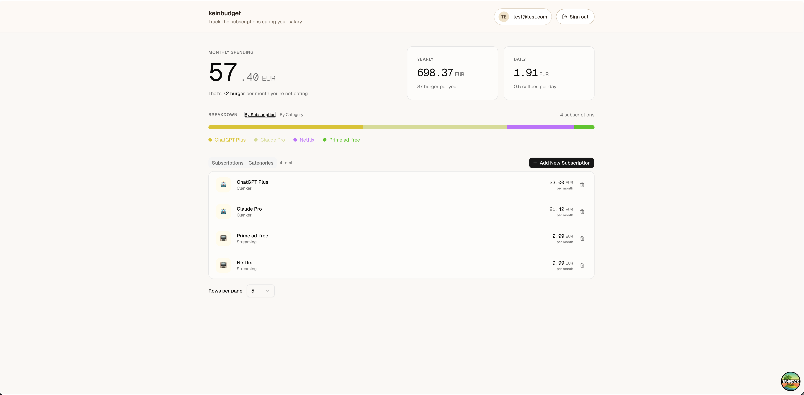

# keinbudget
Track your subscriptions


## Self-Hosting
Just execute the `compose.yaml` 

```sh
$ docker compose up -d
```

For local Docker Compose usage, the auth stack defaults to `http://localhost:4000` and falls back to a development-only `BETTER_AUTH_SECRET` if none is provided. Set your own `BETTER_AUTH_SECRET` before building for any non-local deployment.

## Development
Install dependencies and run the workspace with `pnpm` on Node 22:

```sh
pnpm install
pnpm dev
```

## Techstack
- pnpm workspaces on Node.js 22
- Tanstack Start + React 19 for the web app
- Bun + Hono for the API runtime
- Tailwind CSS 4, Radix UI, and shadcn-style components for the UI
- oRPC + Zod for shared contracts and type-safe API calls
- Drizzle ORM with `postgres` and PostgreSQL for the database layer
- Better Auth for authentication
- Docker Compose for simple self-hosting
