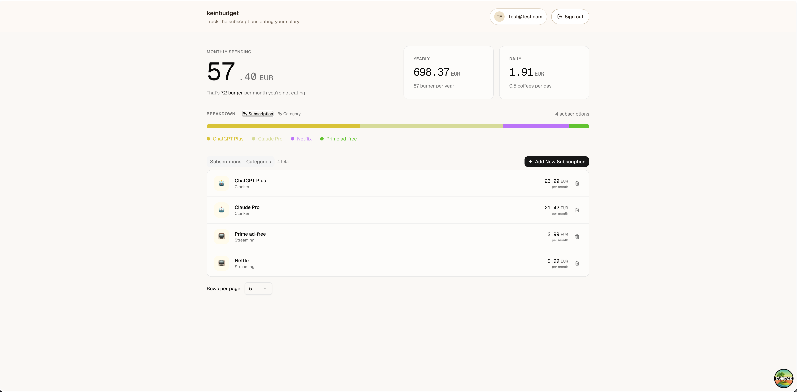

# keinbudget
Track your subscriptions


## Self-Hosting
Just execute the `compose.yaml`

```sh
$ docker compose up -d
```

Runs on port `3000` with a Postgres 17 database. Data is persisted in a named volume.

For non-local deployments, set these environment variables before building:

| Variable | Default | Notes |
|---|---|---|
| `BETTER_AUTH_SECRET` | `dev-only-change-me` | **Required in production** — set a strong secret |
| `BETTER_AUTH_URL` | `http://localhost:3000` | Public URL of your instance |
| `VITE_BETTER_AUTH_URL` | `http://localhost:3000` | Build-time URL — must match `BETTER_AUTH_URL` |
| `POSTGRES_USER` | `keinbudget` | |
| `POSTGRES_PASSWORD` | `keinbudget` | |
| `POSTGRES_DB` | `keinbudget` | |
| `DISABLE_SIGNUP` | `false` | Set to `true` to lock registration after setup |

## Cloudflare Workers deployment

The app can be deployed as a Cloudflare Worker (SSR included) that talks directly to an external PostgreSQL database over TCP (`postgres` driver + `connect()` sockets, so **no Hyperdrive binding is required**). The Node/Docker path above keeps working unchanged — `bun run build` still builds the Node server, `bun run build:cf` builds the Worker.

### Prerequisites

- A Cloudflare account and a PostgreSQL instance reachable from the internet (public hostname, port `5432`)
- Logged in locally: `bun run wrangler login`

### Build and deploy

```sh
# build the Worker bundle (nitro `cloudflare_module` preset)
bun run build:cf

# set secrets/vars once (or use the Cloudflare dashboard > Settings > Variables)
bun run wrangler secret put DATABASE_URL
bun run wrangler secret put BETTER_AUTH_SECRET
bun run wrangler secret put BETTER_AUTH_URL
bun run wrangler secret put DISABLE_SIGNUP

# deploy
bun run deploy:cf
```

Set `BETTER_AUTH_URL` to your deployed HTTPS origin and `BETTER_AUTH_SECRET` to a strong random secret. The browser auth client uses the current origin; no build-time auth URL is needed.

Before serving traffic, apply the database migrations from your local machine or CI with `DATABASE_URL` set to your PostgreSQL connection string:

```sh
bun run db:migrate
```

Use your provider's TLS-enabled connection string. Never commit it.

### Local preview (workerd)

Create a `.dev.vars` file (gitignored) with the same variables as above, then:

```sh
bun run preview:cf
```

### How it works / limitations

- The Worker runs on Nitro's `cloudflare_module` preset with the `nodejs_compat` compatibility flag
- Workers only exposes env vars inside the request lifecycle and closes TCP sockets when the request ends — so on Workers the DB client and Better Auth instance are created **per request**, keyed by the request context (TanStack Start's AsyncLocalStorage). No client state is cached across requests. On Node (`bun run dev`, Docker) one shared client per process is kept, as before
- There is no connection pooling across requests on Workers. Idle connections close after 30s (`idle_timeout`); Workers additionally tears down all sockets at request end. Add a [Hyperdrive](https://developers.cloudflare.com/hyperdrive/) binding if you want pooled connections and query caching — postgres.js accepts its connection string as-is
- Development and Docker deployments still use Node.js

## Development
Install Bun 1.4.0 and Node.js 22, then install dependencies and start the app:

```sh
bun install --frozen-lockfile
bun run dev
```

Run checks with `bun run lint && bun run build && bun run test`. Use `bun run test`, not `bun test`, to run Vitest.

In the Cloudflare dashboard, set the build command to `bun run build:cf` and the build variable `BUN_VERSION` to `1.4.0`.

## Techstack
- Bun for package management, Node.js 22 for the runtime
- Tanstack Start + React 19 for the web app
- Tailwind CSS 4, Radix UI, and shadcn-style components for the UI
- Drizzle ORM with `postgres` and PostgreSQL for the database layer
- Better Auth for authentication
- Docker Compose for simple self-hosting
